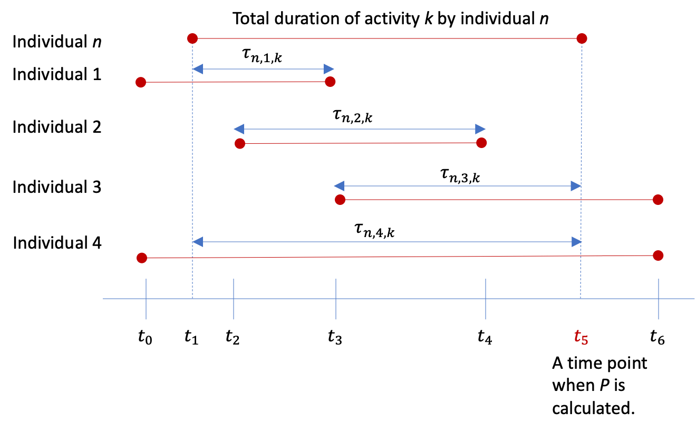

# COMOKIT Albatross (C-Albatross)

COMOKIT-Albatross is a dedicated custom adaptation  of COMOKIT. It  simulates the spread of SARS-CoV-2 at the scale of the Netherlands. The activity diary for COMOKIT comes from the pre-generated mobility agenda in Albatross. The daily activities in Albatross are modelled at the precision of a minute, while the default COMOKIT behavior is modelled at the precision of one hour. The atomic spatial unit of this extension is at a Dutch 6-digit Postal Block level compared to the building level in COMOKIT. Epidemiological dynamics for COMOKIT-Albatross has also been modified to take into account  this larger atomic spatial unit. The larger spatial resolution makes it possible to simulate a wider region, and fits the required spatial distribution of activities as modelled in Albatross agenda generator.

# Albatross: A brief history

Albatross, currently in its version IV was first developed in the year 2000. Between years 2000-2010, three different versions of Albatross have been developed. It is based on the CHAID algroithm for decision trees and tables to extract decision heuristics from a national level activity-travel data. In its version IV, the fundamental change is to move away from a single-day activity generation to a multi-day dynamic forecasting systems.  Please refer the following for full details.

> Rasouli, S., Kim, S., & Yang, D. (2018). Albatross IV: from single day to multi time horizon travel demand forecasting. In Transportation Research Board 97th Annual Meeting.

# Model Summary

| Item | COMOKIT | COMOKIT-ALBATROSS | ALBATROSS |
|:----:|:-------:|:-----------------:|:---------:|
|  Time Step  | 60 min | [10,15,30,60] min | 1min |
| Spatial Unit | Building | Dutch-6 digit post code level | Dutch - 4 digit post code level |
| Spatial Unit - Area |     -    |   3000-7000 sq.m   |     0.8mil-1.9mil sq.m|
| Social network model |     Yes    |         Yes        |     No     |
|  School Activities?  |     Yes    |         Currently No          |  No     |
|  Infection Modeling  |    Yes   |         Yes          |     No    |
|  Infection Model  |   SEIR/SIR   |         (modified)         |     None    |
|  Activity Agenda  |    Generated   | read from Albatross|     Generated     |
|  Size of area modelled  | Urban Locality |   City/ Country |    Country     |

# C-Albatross : extends activity behavior in COMOKIT

## Reading agenda generated by the third party software Albatross

TODO

## Upscaling daily activity location

# C-Albatross : revised epidemiological dynamic

This extension, in particular, replaces the default epidemiological dynamics that are inbuilt in COMOKIT and is outline below. For details, contact the authors.

The probability to become infected (exposed) for individual *n* at a time step 𝑡 can be written as:

$ P_{n,t} = 1 - \exp{[-\theta\sum_{m}^{M} q_{m,t} \times i_{n,m,k} \times \tau_{n,m,k}]} $

*k*: activity at a specific location *l*

*t*: a time step when individual *n* leaves a building (or equally means a time step when activity *k* ends). For example, a time step where t5 belongs in the figure below.

*m*: sum over sampled individuals during activity *k* 

*M*: total number of individuals interact with individual *n* during activity *k* :

1.  random sampling of an arbitrarily pre-defined *M* number of individuals (between 3 and 12 as in the Berlin case?)
2.  random sampling of *M* number of individuals dependent on a) total duration of activity *k,* and b) density of the location for activity *k* 
3. stratified sampling by social network groups (namely, friends, colleagues, relatives, and strangers) of an arbitrarily pre-defined *M* number of individuals 
4. stratified sampling by social network groups (namely, friends, colleagues, relatives, and strangers) of *M* number of individuals dependent on a) total duration of activity *k,* and b) density of the location for activity *k* 

$\theta$: a parameter to be calibrated 

$ \tau_{n,m,k}$ : duration of interaction between two individuals

$i_{n,m,k}$ : contact intensity

​	$	i \sim 		 density \times weight_{activity type} \times weight_{social network group} $

where

 $ density = \frac{number of individuals}{number of addresses} $

$q_{m,t}$ : viral shedding (release) rate (different rates by individual *m*’s status, e.g., symptomatic, asymptomatic)

​		$q \sim  q\prime \times weight_{status}  $

$q\prime$ may follow some (age-specific, latent-period, infectious-period) distributions [^1] 

|            Status            | $Weight_{status}$ |
| :--------------------------: | :---------------: |
|         Symptomatic          |         1         |
| Asymptomatic/Pre-symptomatic |       0.45        |
|         Susceptible          |         0         |

| Activity Type | $Weight_{activity type}$ |  Social Network group  | $Weight_{social network group}$ |
| :-----------: | :----------------------: | :--------------------: | ------------------------------- |
|     Home0     |           0.50           |        Friends         | 0.7                             |
|     Work2     |           0.50           |       Colleagues       | 0.7                             |
|   BringGet3   |           0.10           |       Relatives        | 0.7                             |
|   Business2   |           0.50           | Strangers (all others) | 0.5                             |
|  Groceries3   |           0.70           |                        |                                 |
|   NonGroc3    |           0.70           |                        |                                 |
|   Services3   |           0.70           |                        |                                 |
|   Leisure2    |           0.70           |                        |                                 |
|    Social1    |           0.80           |                        |                                 |
|   Touring1    |           0.50           |                        |                                 |
|    Other3     |           0.50           |                        |                                 |

[^1]: no reliable references yet.

# C-Albatross : preliminary results
